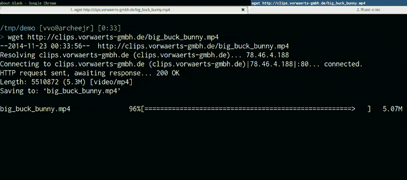

**NOTE FROM AUTHOR**

I am no more using this project or providing any support to it, if you want to maintain it, ping me here: vincent.voyer@gmail.com.

This project was created 4 years ago, there might be better ways to turn a video into a GIF now, use google!

**/NOTE FROM AUTHOR**

# gifify

Convert any video file to an optimized animated GIF. Either in its full length or only a part of it.

## Demo time



This screencast was recorded with [lolilolicon/FFcast](https://github.com/lolilolicon/FFcast) then converted to a GIF with:

```shell
gifify screencast.mkv -o screencast.gif --resize 800:-1
```

## Features

- command line interface
- programmatic JavaScript ([Node.JS](http://nodejs.org/)) [stream](http://nodejs.org/api/stream.html) interface
- unix friendly, supports `stdin` & `stdout`
- optimized! uses [pornel/giflossy](https://github.com/pornel/giflossy) to generate light GIFS
- lots of options: movie speed, fps, colors, compression, resize, reverse, from & to, subtitles
- no temp files used, everything happens in memory
- fast! Extracting a 5-second GIF from the middle of a 2-hour movie takes less than 20 seconds

## Requirements

Before using gifify, please install:

- [Node.js](https://nodejs.org) (`$ brew install node`)
- [FFmpeg](http://ffmpeg.org/) [🐓🐓🐓🐓](http://en.wikipedia.org/wiki/FFmpeg#History) (`$ brew install ffmpeg`)
- [convert](http://www.imagemagick.org/script/convert.php), the famous [ImageMagick](http://www.imagemagick.org/) (`$ brew install imagemagick`)
- [pornel/giflossy](https://github.com/pornel/giflossy/releases), it's a [gifsicle](http://www.lcdf.org/gifsicle/) fork (waiting for [gifsicle#16](https://github.com/kohler/gifsicle/pull/16) to be merged) (`$ brew install giflossy`)

You can also use the [gifify Docker image](https://github.com/maxogden/gifify-docker) which comes with everything installed.

## Installation

```shell
npm install -g gifify
```

## Command line usage

```shell
> gifify -h

  Usage: gifify [options] [file]

  Options:

    -h, --help              output usage information
    -V, --version           output the version number
    --colors <n>            Number of colors, up to 255, defaults to 80
    --compress <n>          Compression (quality) level, from 0 (no compression) to 100, defaults to 40
    --from <position>       Start position, hh:mm:ss or seconds, defaults to 0
    --fps <n>               Frames Per Second, defaults to 10
    -o, --output <file>     Output file, defaults to stdout
    --resize <W:H>          Resize output, use -1 when specifying only width or height. `350:100`, `400:-1`, `-1:200`
    --reverse               Reverses movie
    --speed <n>             Movie speed, defaults to 1
    --subtitles <filepath>  Subtitle filepath to burn to the GIF
    --text <string>         Add some text at the bottom of the movie
    --to <position>         End position, hh:mm:ss or seconds, defaults to end of movie
    --no-loop               Will show every frame once without looping
```

## Programmatic usage

See the [example](./example).

```js
var fs = require('fs');
var gifify = require('gifify');
var path = require('path');

var input = path.join(__dirname, 'movie.mp4');
var output = path.join(__dirname, 'movie.gif');

var gif = fs.createWriteStream(output);

var options = {
  resize: '200:-1',
  from: 30,
  to: 35
};

gifify(input, options).pipe(gif);
```

You can also pass a [readable stream](http://nodejs.org/api/stream.html#stream_class_stream_readable) to `gifify(stream, opts)`.

## Readable stream input performance

Gifify supports streams both on command line (`cat movie.mp4 | gifify -o out.gif`) and in the programmatic API (`gifify(readableStream, opts).pipe(writableStream)`).

While it's super useful in some cases, if you have the file on disk already, you better do `gifify movie.mp4 -o out.gif` or `gifify(filePath, opts).pipe(writableStream)`.

Why? Because piping 3.4GB when you want to cut from 40:20 to 40:22 still takes a loooooot of time and does not give you any performance benefit.

FFmpeg has to read from 0GB -> $START_BYTE_40:20 and discards it. But everything flows in your memory.

When using direct file input from command line, we pass the `-i filename` option to FFmpeg and then it's super fast!

Be careful when `|piping`.

## Adding some text

You can burn some simple text into your GIF:

```shell
gifify back.mp4 -o back.gif --from 01:48:23.200 --to 01:48:25.300 --text "What?..What?What?"
```

Result:


## Subtitles

You can burn subtitles into your GIF, it's that easy:

```shell
gifify 22.mkv -o movie.gif --subtitles 22.ass --from 1995 --to 2002 --resize 600:-1
```

You must create new subtitles files, the timecodes for the complete film will not work for a five seconds GIF.

Create subtitles using [aegisub](http://www.aegisub.org/) and augment the font size for a great effect!

Here's the `22.ass` from the previous command, created with aegisub:

```ass
[Script Info]
; Script generated by Aegisub 3.2.1
; http://www.aegisub.org/
Title: Default Aegisub file
ScriptType: v4.00+
WrapStyle: 0
ScaledBorderAndShadow: yes
YCbCr Matrix: None

[Aegisub Project Garbage]

[V4+ Styles]
Format: Name, Fontname, Fontsize, PrimaryColour, SecondaryColour, OutlineColour, BackColour, Bold, Italic, Underline, StrikeOut, ScaleX, ScaleY, Spacing, Angle, BorderStyle, Outline, Shadow, Alignment, MarginL, MarginR, MarginV, Encoding
Style: Default,Arial,20,&H00FFFFFF,&H000000FF,&H00000000,&H00000000,0,0,0,0,100,100,0,0,1,2,2,2,10,10,10,1

[Events]
Format: Layer, Start, End, Style, Name, MarginL, MarginR, MarginV, Effect, Text
Dialogue: 0,0:00:02.50,0:00:03.97,Default,,0,0,0,,{\fnLiberation Sans\fs40}Okay, okay.
Dialogue: 0,0:00:05.00,0:00:06.90,Default,,0,0,0,,{\fnLiberation Sans\fs40}Okay. Okay.
```

Result extracting a GIF from [22 Jump Street](http://www.imdb.com/title/tt2294449/):


## GIF Performance

```
On modern hardware GIF is the slowest and most expensive video codec. Can we please allow it to be obsoleted?
```

https://pornel.net/efficient-gifs#sec44

YOLO!

## Giflossy

[Giflossy](https://github.com/pornel/giflossy) is a fork of [gifsicle](http://www.lcdf.org/gifsicle/), gifsicle author is currently [working on](https://github.com/kohler/gifsicle/tree/lossy) integrating the lossy part in gifsicle.

So in little time we will be able to directly use gifsicle and gifiscle packages.

## Thanks

[jclem/gifify](https://github.com/jclem/gifify/) was a great source of inspiration.
